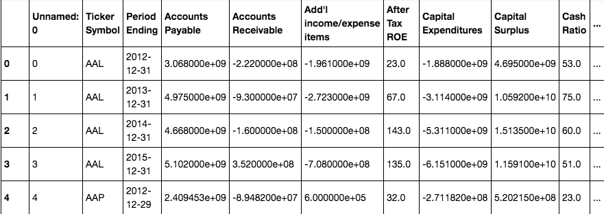
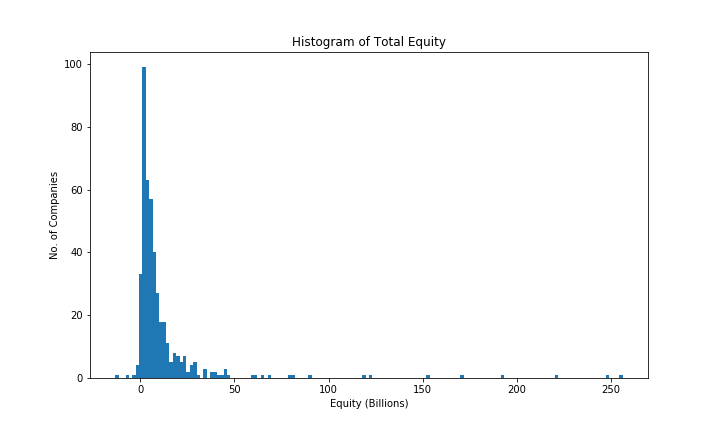
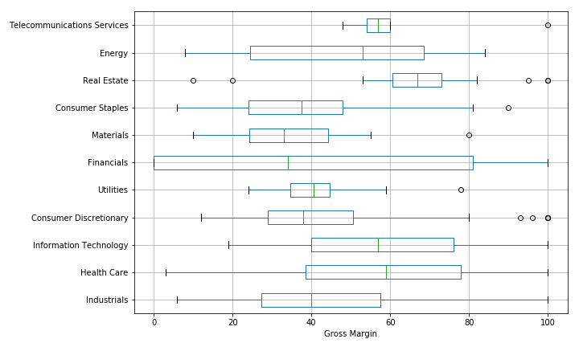
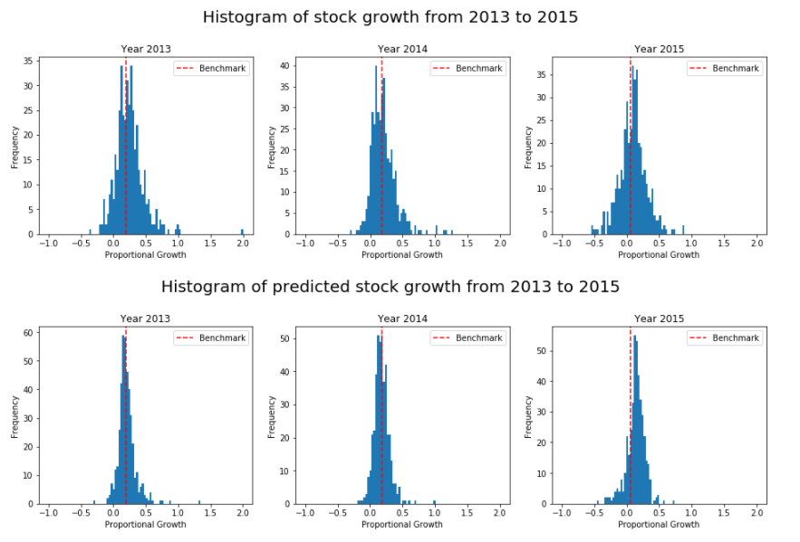

# Machine Learning Engineer Nanodegree
## Capstone Project
Edward Liu  
April 27th, 2017

## I. Definition

### Project Overview

In the modern day financial industry, algorithms are being used intensively by funds and investment companies for trading. A large number of both rule-based and machine learning based algorithms have already been developed for this purpose. The majority of these algorithms are designed to operate at relatively high frequencies and profit from the short-term fluctuations of the stock market. However, there are many value investors who make their investment decisions based on the [fundamentals](http://www.investopedia.com/terms/f/fundamentals.asp) (metrics that reflect the intrinsic value) of a stock; rather than technical analysis, which focuses solely on the price history of a stock. To value investors, trading algorithms are less useful. The aim of this project is to build a machine learning based model that helps value investors estimate the future value of stocks based on its current fundamental data. 

The dataset used to train the model is the [NYSE S&P 500 companies historical prices with fundamental data](https://www.kaggle.com/dgawlik/nyse), hosted on Kaggle. This dataset contains around 50 fundamental attributes of companies traded on NYSE, which is available for the past 4 years. It also contains the prices for these companies on the daily basis.

### Problem Statement

The aim of this project is to build a model that predicts the future change in the price of a stock based on the changes of its fundamentals. This model can then be used to aid value investors in their decisions.

The tasks involved are the following:

1. Download the NYSE S&P 500 companies historical prices with fundamental data.

2. Implement the baseline model and test it on the data.

3. Handcraft various features and normalize them.

4. Create a training set of 60% of the data, a cross-validation set of 20% of the data and a test set of the last 20%. 

4. Implement and train several regression models. Cross-validate the models and evaluate their performance.

5. Choose the model that gave the best validation performance and used grid search to optimize its hyperparameters.

6. Wrap the model in a function that can be called with the fundamentals of a company and output a prediction of its future price change.

The final solution should be able to predict the changes in price with reasonable accuracy and outperform the benchmark.

### Metrics

The metric used for this project is the mean squared error, which is also used as the loss function when training the model. This is derived by the equation below:

{MSE}={\frac  {1}{n}}\sum _{{i=1}}^{n}({\hat   {Y_{i}}}-Y_{i})^{2}$

where $Y_{i}$ is the actual output, $\hat  {Y_{i}}$ is the target output and ${n}$ is the number of data points.

Mean squared error is chosen because it only takes into account the absolute difference between the output and the target. This is important because underestimates and overestimates of the stock price are equally undesirable for investors.

## II. Analysis

### Data Exploration

The _S&P 500 companies historical prices with fundamental_ data has four files. The following two are used in this project: 
* ``prices-split-adjusted.csv``
This contains the prices of companies in the S&P 500 on the daily basis between the years 2010 and  2016.

* ``fundamentals.csv``
This contains the fundamental data from the S&P 500 companies, but only between the years 2012 to 2015. 

There is a total of 500 companies included in the dataset. Each company has 76 fundamental metrics, all of which are float variables. A subset of the metrics can be seen on __Fig. 1__. 

__Fig. 1__ &nbsp; A sample of the data inside ``fundamentals.csv``

However, many of the companies have data that contain ``NaN`` in either their fundamentals or their prices. After removing these entries, only 418 companies remain in the dataset. 

It can be seen from __Fig. 1__ that most of the fundamentals metrics are in the order of millions, which is too large to be used as features. To address this problem, the fundamentals need to be represented as ratios. This is discussed in further detail in the __Data Preprocessing__ section.

### Exploratory Visualization

__Fig. 2__ &nbsp; A plot showing how the total equity of the companies in the S&P 500 are distributed. 

Total equity is a reliable representation of the size of the company and the differences in company size can give insights on the preprocessing procedures needed. It can be seen that the distribution has a very large positive skew. Most companies lie between the 0 to 25 billion range but there are some that reach as much as 250 billion. This suggests that simply normalizing by subtracting the mean and dividing by the range will be ineffective because most of the samples will be overwhelmed by the few with the largest values.

__Fig. 3__ &nbsp; Box chart of the gross margins of companies in different industries.

Fig. 3 illustrates the diversity of the companies in the dataset. The gross margin is the operating income divided by total sales revenue. It represents the ceiling on the profitability of a company. As it can be seen on the figure, gross margins can vary dramatically between different industries. For example, the lowest gross margin of _Real Estate_ companies is similar to the highest gross margin of _Materials_ companies, excluding outliers. This suggests that many of the other metrics are likely to have large variations across industries. Large errors might be introduced when comparing companies directly. 

The solution used by this project for the problem presented by Fig. 3 is to only compare the metrics of companies with those of the same company in the previous year. More of this is described in a later section.

### Algorithms and Techniques

This project intends to experiment with several regression algorithms and choose the most suitable algorithm based on the results. This algorithm will then be fine-tuned using grid search to produce the final optimized model.

The candidate algorithms and their parameters as listed as follows: 

1. __Linear Regression__ (No parameters)

2. __Random Forest__
    * Number of estimators (number of trees in the forest) 
    * Maximum depth (maximum depth the trees can grow to)
3. __Multi-layer Perceptron__
    * Number of layers (depth of the network)
    * Layer size (number of neurons in each layer)
    * Activation (non-linearity at the end of each layer)
    * Learning rate (how fast the model tries to learn)

Note: only the parameters that are intended to be optimized are listed.

The training will be done using the [scikit-learn](http://scikit-learn.org/stable/) library, which has wrapper functions for all the above algorithms. The model will be trained on a CPU because the dataset is relatively small and the algorithms are not complex.

### Benchmark

The benchmark model is based on the S&P 500 index, which is computed by taking the weighted average of the market capitalization of the 500 stocks traded on the U.S. stock market. This model will assume that all companies will have the same proportional change in market capitalization as the S&P 500 index.

The reason behind the choice of this benchmark is that investment algorithms can only be considered effective if they manage to outperform the market, in this case it is the S&P 500.

## III. Methodology

### Data Preprocessing

The preprocessing procedure consists of the following steps:

1. Compute the average prices of stocks from `prices-split-adjusted.csv` on a yearly basis, for the years 2012 to 2015.
2. Compute the proportional increase in stock prices from 2013 to 2015.
3. Compute the proportional increase in the S&P 500 index for the same period.
4. Obtain the following metrics from `fundamentals.csv` for all the companies from 2012 to 2015:
    * Earnings Per Share 
    * Debt to Equity Ratio
    * Book Value
    * Current Ratio
    * Net Operating Cash Flow
    * Net Financing Cash Flow
    * Net Investing Cash Flow

    __Note:__ These metrics have been selected based solely on value investing theory and __not data processing__ techniques. Therefore the reasons for their selection are not discussed in this report.

5. Compute the proportional changes in the above metrics for all companies from 2013 to 2015

    __Abnormality Correction:__ By using the changes in the metrics as features rather than the metrics themselves, the difference between industries is greatly reduced. It also has the desirable effect or normalizing the features to values that are mostly between -1 and 1.
    
6. Match the fundamental metrics to the prices and randomly shuffle the entire dataset.
7. Split the data into _training (60%)_, _validation (20%)_ and _test (20%)_ sets.

### Implementation

The implementation of the algorithms involves the following steps:

1. Load the dataset files and preprocess them as described in the _data preprocessing_ section.
2. Create the three candidate models using the scikit-learn functions `LinearRegression()`, `MLPRegressor()` and `RandomForestRegressor()`. Default values are initially used for all parameters.
3. Call the `.fit()` member function of each model, passing in the training set as argument to train the models.
4. Evaluate the cross-validation loss of the models using the built-in function `mean_squared_error()`
5. Evaluate the cross-validation loss of the benchmark. Compare the performance of all three models with the benchmark.
6. If any model outperforms the benchmark, choose the model with the lowest cross-validation loss to be further optimized. If no model beats the benchmark, return to step 2 and experiment with different models.

### Refinement

Following on from the previous section, the results for the benchmark and the three candidate models are listed in Table. 1.

__Table. 1__ &nbsp; MSE of the models tried compared to the benchmark.
| Model                 | Mean Squared Error |
|-----------------------|--------------------|
| Benchmark             |     0.0312         |
| Linear Regression     |     0.0325         |
| Multi-layer Perceptron|     0.0369         |
| Random Forest        |     __0.0240__     |

It can be seen that `Random Forest` is the only model that outperforms the benchmark, hence it is chosen for further refinement.

The model is improved upon using the technique of grid search cross-validation. This procedure optimizes the following parameters:
* Number of estimators (more estimators would make the model more powerful but also make computation more expensive)
* Maximum Depth (Maximum depth restricts the complexity of the estimator, making it less likely to overfit)

Grid search creates an exhaustive grid of all the combinations of the parameter values. For this project, the following grid was used:

* Number of estimators: [50, 100, 150]
* Maximum depth: [5, 10, 15]

The validation mean squared error of all the models in the grid can be seen from Table. 2.

__Table. 2__ &nbsp; Result of grid search
|    |    estimators=50   |   estimators=100   |   estimators=150   |
|:--:|:-------:|:-------:|:-------:|
|  __max_depth=5__ | 0.02840 | 0.02830 | 0.02833 |
| __max_depth=10__ | 0.02284 | 0.02247 | 0.02269 |
| __max_depth=15__ | 0.02162 | __0.02129__ | 0.02144 |

Grid search shows that the best performance occurs when the maximum depth is 15 and the number of estimators is 100. Interestingly, having larger trees did not cause the model to overfit and resulted in an increase in validation performance. 

## IV. Results

### Model Evaluation and Validation

The final model is a random forest regressor with _100_ estimators and a maximum tree depth of _15_. It has a training loss of _0.00507_ and a validation loss of _0.02129_. The parameters were derived from grid search and this particular model gave the lowest validation MSE. This seems to suggest overfitting. however, when fine-tuning the model, limiting the complexity of the model didn't improve the validation loss. A possible explanation is that due to the small size of the dataset, the model is powerful enough to capture almost all of its details; but there is not enough data for it to generalize very well.

To test the model on unseen data, the performance of the model on a previously unseen test set (the remaining 20% of the data) is evaluated. The model has an error of _0.02679_ on the test set, which is higher than the validation error of _0.03735_ by _39.6%_. This shows that the model does overfit to both the training set and the validation set, but the degree of overfitting is acceptable. 

### Justification

Table. 3 shows the result of the model in comparison to the benchmark. It can be seen that the mode outperforms the benchmark in all three of the datasets. 

__Table. 3__ &nbsp; Mean squared error of the model compared to the benchmark.
|           | Training | Validation | Test    |
|:---------:|----------|------------|---------|
| __Benchmark__ | 0.04651  | 0.04144    | 0.06269 |
| __Model__     | 0.00507  | 0.02360    | 0.03735 |
| __Improvement(%)__| 89.1 | 43.1 | 40.4 |

The improvement of the model from the benchmark exceeded 40% for the previously unseen test set. Therefore, it is reasonable to say that the solution has solved the problem. However, since the model is only trained with data from the companies in the S&P 500 index. The same performance should not be assumed on stocks outside the S&P 500. 

## V. Conclusion

### Free-Form Visualization

__Fig. 5__ &nbsp; Histograms of actual price changes and predicted price changes.

Some aspects of Fig. 5 are worth noting:

1. The histograms of the predicted prices have roughly the same distribution as those of the actual prices, both of which take the form of roughly a gaussian.
2. Compared to the actual price changes, the price changes predict by the model tend to be more conservative, which is shown by a distribution with a smaller variance.
3. The predicted price changes are roughly centered about the benchmark, with the exception of the year 2015; in which case the predictions are more optimistic.

### Reflection

The entire project features the following steps:

1. Identification of the problem and finding the relevant datasets.
2. Preprocessing the data to obtain the required features.
3. Implementing a baseline model and testing its performance.
4. Experiment with a few candidate models and select the best model for further optimization
5. Optimize the model to create the final solution.

The final solution does meet my expectations for the problem. However, because they are trained with very limited data, great caution should be taken when using the model for real investment decisions.

The most interesting part of this project is the surprisingly good performance of ensemble models. Their performance have far surpassed the other models and they are the only models that can outperform the benchmark.

The most difficult part of the project was the preprocessing of the data. I had to experiment with many of the functionalities of Numpy and Pandas that I was previously unfamiliar with, but it turned out to be very rewarding.

### Improvement

In order for the model to be more applicable to real markets, a substantially larger dataset is needed for training. Also, as the current model uses hand picked features, a potential improvement is to use a data based feature selection method to select the most important features. Finally, for the solution to be usable by investors, a user friendly web interface needs to be created that calls server APIs to make predictions.

